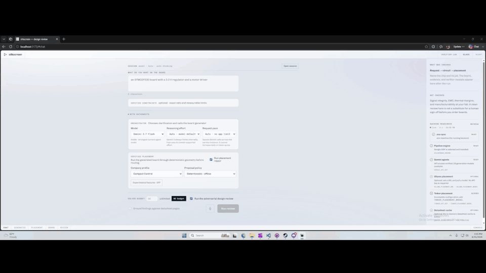
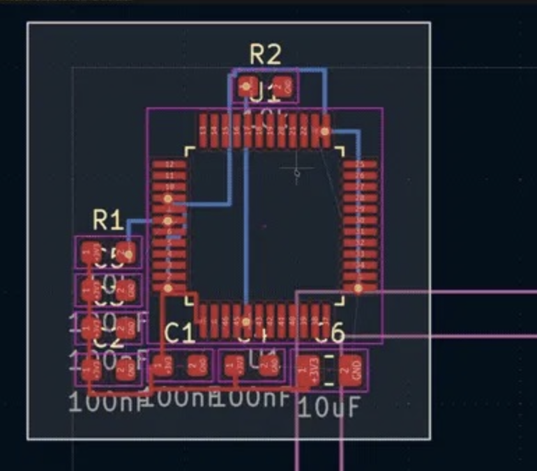

# Ada

[](https://github.com/machmoon/Ada/actions/workflows/ci.yml)
[](https://www.python.org/downloads/)
[](https://www.kicad.org/download/)
[](LICENSE)

**Ada is an AI hardware engineer that works beside KiCad: describe a board, get a
schematic and a placed and routed board checked by KiCad's own ERC and DRC, and a
printable case checked clause by clause on the solid.** For a beginner before the first
dead board, and a senior engineer before fab.

- **The problem.** A first board usually comes back dead over something its datasheet
  stated plainly. Every EDA tool checks that a wire reaches a pin; none checks that it
  was the right pin.
- **Who it is for.** A beginner who cannot yet tell a correct schematic from a plausible
  one, and a senior engineer who can but wants a second reader that cites the page.
- **What it lets them do.** Describe a board in the desktop app next to a running KiCad
  and press each step in turn: datasheets read, a validated circuit, a `.kicad_sch`,
  CP-SAT placement, routed copper with a ground pour, a printable case with measured
  clauses, a BOM, and a review with citations. Every step the engineer runs waits for a
  press; the case and sourcing designs are prefetched when placement lands, and the step
  envelope says so (`background: ["case", "sourcing"]`). `kicad-cli` runs ERC, DRC and
  schematic parity on the result;
  [`docs/measurements/board-eval-2026-09-16.json`](docs/measurements/board-eval-2026-09-16.json)
  records six circuits with 0 errors on all three and an 18-part ESP32 dev board 100 %
  routed with DRC 0 (a scripted circuit through the real engine).
- **How it makes money.** **Ada Pro** is one entitlement, `pro`, bought inside the
  desktop app through the RevenueCat Web SDK; it unlocks the **Prepare fab order** step,
  gated on the client and, when `REVENUECAT_SECRET_API_KEY` is set, on the service. Today
  it is a RevenueCat Test Store purchase: simulated, no money moves. The Stripe usage
  metering in [`billing/`](billing/) is the launch path and is off unless `KALEO_METERING`
  is set.
- **What makes it different.** Verification is the product. The model proposes; KiCad's
  own checks, a SPICE verifier and a CAD kernel decide, each with a signed margin, and
  every integration reports what actually happened in a fixed vocabulary. The KiCad
  integration is a file format, not a plugin or a robot arm.

**Two names, one thing.** *Ada* is who you talk to: the AI hardware engineer and the
desktop app in [`app/`](app/). *Silkscreen* is the engine underneath: the Python package,
the `silkscreen` command, and most of this repository. Ada is a client of Silkscreen;
either can be used without the other.

Demo video: (YouTube link to be added before submission)

The earlier entry, for the All Things Agentic hackathon on 2026-08-31 (Gemini, ADK, Cloud
Run), is kept in [docs/google-hackathon.md](docs/google-hackathon.md). The Shipaton
entry text is [DEVPOST.md](DEVPOST.md).

## What it connects to

| App | What Ada does with it | Verified live today |
|---|---|---|
| **Google Gemini API** | proposes circuits, cases, reviews, meeting replies | yes |
| **KiCad** | opens the generated `.kicad_sch`/`.kicad_pcb`; `kicad-cli` ERC, DRC and schematic parity | yes |
| **Gmail + Google Calendar** | emails the board, books a review meeting with a Meet link (OAuth, PKCE) | sign-in connected |
| **Google Meet** | a bot joins the call, reads captions, speaks, extracts the request (`meetbot/`) | joins the lobby; listen/speak tested offline |
| **FreeCAD** | opens the generated case STEP assembly | yes |
| **Slack** | DM an idea, the laptop starts the build, progress posts to the thread (Socket Mode) | tested offline |
| **Mouser** | verifies proposed part numbers (with `MOUSER_API_KEY`) | tested offline |

**How to run it.**

```bash
python -m venv .venv && ./.venv/bin/pip install -e ".[dev,agents,cad,meet,slack]"
cp .env.example .env            # set GOOGLE_API_KEY
cd frontend && npm install && npm run build && cd ..
cd app && npm install && cd ..  # desktop app (needs Rust + Node 22)
./.venv/bin/silkscreen serve    # engine on :8081 and the Ada desktop app
# optional front ends
./.venv/bin/python -m meetbot.session sign-in              # once, for the Meet bot
./.venv/bin/python -m meetbot join https://meet.google.com/xxx-xxxx-xxx
./.venv/bin/python -m slackbot socket                      # needs SLACK_BOT_TOKEN, SLACK_APP_TOKEN
```

CLI only: `./.venv/bin/silkscreen "a 3.3V LDO board" --model gemini-3.5-flash -o out/board.kicad_pcb`.

**How we know it works (reliability and evaluation).**

- **Model output is never trusted.** Every Gemini answer is JSON that deterministic
  validators check; all failures go back to the model as one repair prompt, then the
  run refuses loudly rather than building a wrong board.
- **Checked by the real tools.** Generated boards are run through KiCad's own ERC, DRC
  and schematic-parity checks (0 errors on the demo prompts); the router names every net
  it could not finish instead of reporting success.
- **Signed margins, not pass/fail flags.** The case CAD kernel measures 13 clauses on the
  B-rep (plug clearance, wall thickness, overhang, lid fit…) and reports each with a
  signed margin in millimetres. Today's live run found two failures, which we reproduced
  exactly, fixed, and pinned with regression tests that fail on the old code.
- **Independent-math tests.** Geometry and SPICE tests compute expected answers
  independently of the code under test, so a shared bug cannot pass both.
- **Offline, deterministic test suite.** Thousands of tests run with no network and no API
  keys: `ScriptedModel` stands in for Gemini and recorded transports stand in for Google,
  Slack, Meet and Mouser. CI runs them on Linux, macOS and Windows.
- **Honest failure vocabulary.** Every integration reports what actually happened
  (`verified` / `proposed` / `unavailable`, `spoken: true` only when audio really played),
  and the demo recordings document what broke.



The recording above is the browser SPA (`frontend/`), not the desktop overlay in `app/`.



**Silkscreen is a Python program you run.** The command line is the product; the web UI
is a viewer for what it produced, and is the less-supported path — see
[Which interface](#which-interface).

<!-- SCREENSHOTS WANTED — do not uncomment until the files exist under docs/img/:
     docs/img/review.png    the review pane with findings and citations
     docs/img/schematic.png the Schematic tab
-->

---

## Quickstart

Python 3.11 or newer. **No KiCad install or API key is needed to install it or
run the whole test suite. After dependencies are installed, the suite itself
makes no network calls.**

**One command.** It finds a Python 3.11+, creates `.venv`, installs the engine editable
with its extras, and builds the web UI if Node 22+ is on your PATH (skipped, not fatal,
if it isn't). Nothing is written outside the repo and it never uses `sudo`:

```bash
git clone https://github.com/machmoon/Ada && cd Ada
./scripts/install.sh                                           # macOS / Linux
powershell -ExecutionPolicy Bypass -File scripts\install.ps1   # Windows
```

Then, optionally, one command to configure a key and one to open the app:

```bash
./.venv/bin/silkscreen setup    # writes .env; never echoes the key back
./.venv/bin/silkscreen serve    # starts the API + UI and opens the Ada desktop app (--web for the browser)
```

<details>
<summary><b>Or install by hand</b> (three lines, same result)</summary>

```bash
python3 -m venv .venv
./.venv/bin/pip install -e ".[dev,agents,cloud,adk,cad]"   # Windows: .venv\Scripts\pip
./.venv/bin/python -m pytest -q                    # offline; no keys required
```
</details>

<details>
<summary><b>Or run the web UI in Docker</b> (no Python or Node on your machine)</summary>

```bash
docker build -t silkscreen .
docker run -p 8080:8080 -e GOOGLE_API_KEY=... silkscreen   # http://localhost:8080
```

The image builds the Svelte bundle in a Node stage and serves it from the Python
service, same origin as the API.
</details>

Then place a board — no API key, nothing to configure, and it finishes in about
20 seconds:

```bash
./.venv/bin/python scripts/demo.py
```

To go from a prompt to a board you need a Gemini key (`GOOGLE_API_KEY`); everything
else works without one:

```bash
./.venv/bin/silkscreen setup    # or: cp .env.example .env, and edit it
./.venv/bin/silkscreen "a 3.3V motor driver around an STM32F103" -o board.kicad_pcb
```

`setup` and `serve` are the only subcommands; any other argument is the plain-language
intent, so `silkscreen "..."` and `python -m silkscreen "..."` are the same generator.

One run leaves you a KiCad project, one file per stage:

```
wrote board.kicad_pro          ← open this in KiCad
wrote board.kicad_sch          ← the schematic
wrote board.placed.kicad_pcb   ← after placement, before any copper
wrote board.kicad_pcb          ← routed
```

Every stage is a real KiCad file you can open and inspect on its own, so you can see
where a design went wrong instead of only seeing the last artifact.

```
3905 tests collected — no network, no API key, no KiCad install
```

**Next:** [full install guide and troubleshooting](docs/install.md) ·
[contributing](CONTRIBUTING.md) · [how it works](#prompt-to-pcb)

**Download:** [tagged releases](https://github.com/machmoon/Ada/releases) carry the
Python wheel and built web UI. The native **Ada** macOS shell currently runs
from a checkout; `.dmg` packaging, signing, and notarization are not yet built.

---

## Which interface

| | `python -m silkscreen` *(recommended)* | Web UI |
|---|---|---|
| Schematic (`.kicad_sch`) | ✅ | ❌ not surfaced |
| Routed copper | ✅ | ✅ in the downloaded file only — the board well draws placement, not tracks |
| Per-stage files you can open | ✅ | ❌ final board only |
| KiCad project (`.kicad_pro`) | ✅ | ❌ |
| Adversarial review, findings, citations | ✅ text | ✅ nicer to read |

**The CLI is still the complete project-output path.** The web UI (`service/` +
`frontend/`) now starts with a persistent orchestrator chat, shows the observable model,
tool, validation, and retry activity, and hands you compact cards for the schematic,
placement diagram, review, and final `.kicad_pcb`. It still does not return the native
`.kicad_sch`/`.kicad_pro` or draw routed tracks, so use the CLI when those files matter.

---

## How you are meant to run this

**Not to run Silkscreen. Yes, strongly recommended, to do anything with what it makes.**

Silkscreen writes the KiCad formats itself, so nothing in the pipeline shells out to
KiCad, imports `pcbnew`, or touches your mouse. But the output *is* a KiCad project,
and without KiCad you have files you cannot open, check, or fabricate. Silkscreen's
router leaves hard nets unrouted on purpose and tells you which — finishing them is
work you do in KiCad. Install it unless you have a specific reason not to.

| | Without KiCad | With KiCad *(strongly recommended)* |
|---|---|---|
| Generate a schematic and a routed board from a prompt | ✅ | ✅ |
| Run the test suite | ✅ | ✅ |
| Deploy the service, use the MCP server or the Slack bot | ✅ | ✅ |
| **See the schematic and the board** | ❌ | ✅ |
| **Finish the nets the router left unrouted** | ❌ | ✅ |
| **Run DRC and electrical rules check** | ❌ | ✅ |
| **Export Gerbers and get it fabricated** | ❌ | ✅ |

Skip KiCad if you are running Silkscreen in CI, on a server, or inside another tool
that consumes the file. Install it if you are a person who wants to see a board.
Platform-by-platform commands are in [docs/install.md](docs/install.md#kicad-optional-but-recommended).

---

## Status

| Component | State |
|---|---|
| `kicad.py` — `.kicad_pcb` read/write | **Working** · 33 tests |
| `packing.py` — CP-SAT placer | **Working** · 50 tests |
| `netlist.py` — validated circuit IR | **Working** · 31 tests |
| `schematic.py` — `.kicad_sch` + `.kicad_pro` emission | **Working** · 38 tests · KiCad ERC clean |
| `routing.py` — two-layer grid autorouter | **Working, partial by design** · 67 tests — see below |
| `footprints.py` + `board.py` — land patterns, board emission | **Working** · 36 tests |
| `agents/` — datasheet, propose, review, pipeline | **Working** · 74 tests |
| `agents/adk/` — ADK dynamic-workflow driver for the pipeline | **Working** · 21 tests |
| `agents/retrieval.py` — page-cited datasheet retrieval | **Working** · 15 tests |
| `agents/resilience.py` — provider failover | **Working** · 34 tests |
| `fab.py` — Gerber, Excellon, BOM, pick-and-place | **Working** · fab package export |
| `order.py` — order options, manufacturability preflight | **Working** · blocks an unrouted board |
| `sourcing.py` + `models3d.py` — BOM with distributor-checked MPNs, probed datasheets, library 3D models | **Working** · an MPN is `verified` only when Mouser lists that exact part number (`MOUSER_API_KEY` required); otherwise `proposed`, with `verify_error` saying why. `verified` means listed, **not** in stock and **not** the right package |
| `mcp/` — MCP server over stdio | **Working** · 48 tests |
| `audit/` — optional visual design review | **Working** · 52 tests |
| `service/` — Cloud Run + Firestore cache | **Working** · 165 tests · deployed once to <https://silkscreen-vqdj4x5qbq-uc.a.run.app>, **currently down** (`/readyz` → 500, `/` → 503 on 2026-09-06, unhealthy since 2026-09-05). Redeploy with `scripts/deploy.sh` and re-verify with `curl -s -o /dev/null -w '%{http_code}' <url>/readyz` before a demo |
| `slackbot/` — Slack bot over the pipeline | **Working** · untested against a live workspace |
| `googleapps/` — Chat, Gmail and Calendar delivery over the pipeline | **Working** · untested against live Google APIs |
| `specreview.py` + the `spec_review` destination — a run's open questions become a booked meeting | **Working** · the Calendar half is untested against live Google APIs |
| `zoombot/` — Zoom front end over RTMS | **Partial by design** · receive and chat halves built, tested offline only; audio out is a spec plus a refusing stub; never run against a live Zoom account |
| `teamsbot/` — Microsoft Teams front end over Graph | **Partial by design** · transcript and chat halves built, tested offline only; the calling bot answers 501; never run against a live tenant |
| `GET /integrations` + the desktop Integrations panel | **Working** · read-only configuration state, never a secret and never a live call |
| `frontend/` — Svelte review UI, served by the service | **Working** · persistent orchestrator chat, expandable traces, session JSON, review, schematic, placement and board tabs; spoken intent and findings read aloud via the browser's own Web Speech API (dictation on the intent and clarification fields in Chrome/Edge — Firefox has no recognition API and gets a notice; findings read by `speechSynthesis` with a stop control; never auto-started). Local-Whisper dictation is not built (`vendor/openwhispr/` is the reference) |
| `engine/silkscreen/placement/` — verifier-grounded repair and company profiles | **Working** · deterministic and Gemini policies; experimental providers are opt-in |
| `constraints.py` — approved build contract and post-route receipt | **Working** · opt-in, fail-closed, and deterministically tested |
| Voice / talk input | **Working** · push-to-talk and "Ada" wake word in the desktop overlay (ear toggle, off by default, paid windows capped at 15); the web SPA's separate browser Web Speech dictation and read-aloud are listed under `frontend/` |
| `app/` — the Ada desktop overlay (Tauri) | **Working** · approval-gated step strip over a live KiCad, order step with GLB export, in-app 3D board viewer (`ModelViewer`), Workspace delivery panel |
| Guided cursor | **Half built** · the in-webview pointer ships (`frontend/src/lib/guide.js`, `GuidePointer.svelte`, "Show me" on a finding); pointing at anything *outside* our own window — KiCad, a terminal, the OS — is **not built**, and there is no screen capture, accessibility-tree read or OS overlay behind it |
| `spice/` — typed testbenches, decks, measurements, signed-margin assertions | **Working** · opt-in simulation stage since 2026-09-06 (`--simulate` on the CLI, `"simulate": true` on `/generate`, the `simulate` nodes in the ADK graph), plus the MCP tools, `scripts/simulate_demo.py` and direct calls; needs ngspice on PATH, and a circuit holding a `Device` or a crystal is reported `unsimulatable` by name |

Every module above is covered by tests that run with no network, no API key, and no
KiCad install. The count is deliberately not quoted here — it drifts, and
`scripts/check_docs.py` fails CI when a quoted one goes stale.

---

## PCB placement agent

After the normal placer produces a board, Silkscreen projects its canonical
integer-nanometre geometry into a bounded millimetre verifier, accepts only
score-improving moves, writes accepted positions back to the canonical board,
and only then routes copper. If the company profile needs more edge or clearance
space than CP-SAT's tight outline provides, the adapter minimally expands that
outline before repair. The placement view shows the before and after geometry
together with a receipt for every proposed move.

The legality boundary is deterministic: board bounds, courtyard clearance,
keepouts, and fixed parts. Company preferences are lower-priority terms for
functional grouping, connector access, compactness, and thermal separation.
Gemini may propose `PLACE` and `MOVE` actions, but it cannot override the
verifier. The model-free policy remains available for reproducible runs.

Ollama, Tinker, hybrid policy selection, and training traces are behind an
**Experimental placement features** control that is off by default and enforced
again by the service. Trace recording requires separate explicit consent.
The focused lab keeps corrections in that browser tab's session storage. The
public endpoint applies feedback to one request only; durable shared company
memory remains intentionally unavailable until tenant authentication exists.

The focused `/?mode=placement` lab remains available for comparing the two
included company profiles. See [the placement-agent architecture](docs/placement-agent.md)
for the agent, supervised fine-tuning, reinforcement learning, and verifier boundary.

---

## Approved build constraints

The main prompt form has an optional **Verified constraints** editor. It is collapsed
and disabled by default, so the ordinary prompt-only demo is unchanged. When enabled,
the editor requires exact net names, measurable limits, and an explicit engineer
approval. Any prompt or manifest edit clears that approval. Version 2 manifests are
strict: unknown fields, unknown constraint kinds, duplicate ownership, unsupported
layers, and zero-area physical limits are rejected before cache access or a model call.

The approved manifest is included in the circuit-proposal context, then checked again
against the validated circuit, final placement, and routed copper. The receipt reports
verified, violated, unresolved, and not-required checks for connectivity, routed
geometry, pull-ups, board outline, keepouts, fixed placements, and other declared
limits. Claims that need evidence this engine does not have—such as controlled
impedance without a stackup/field solver, plane continuity, component height, or a
complete voltage-drop model—remain **unresolved** and block production-promotion
eligibility rather than being guessed.

This is currently a post-build eligibility receipt, not a second placer or router.
Board dimensions, keepouts, fixed locations, and soft weights do not yet configure the
CP-SAT or A* solve directly. Soft terms score the one generated result for comparison;
they do not prove that alternatives were ranked. A blocked receipt leaves the generated
KiCad artifact available for inspection, but the orchestrator identifies it as not
eligible for production promotion.

---

## Prompt to PCB

```bash
echo 'GOOGLE_API_KEY=...' >> .env
python -m silkscreen "a 3.3V motor driver board around an STM32F030" \
    --datasheet "AMS1117-3.3=https://.../ams1117.pdf" \
    -o board.kicad_pcb
```

```
intent ─► datasheets ─► propose/validate ─► CP-SAT place ─► verifier repair
                                                                │
               .kicad_pcb ◄─ route ◄─ .kicad_sch + placed board ◄┘
                     │
                     └─► adversarial review
```

| Stage | Module | Artifact |
|---|---|---|
| Datasheet reading (Gemini native PDF vision) | `agents/datasheet.py` | |
| Retrieval over datasheet text, page-cited | `agents/retrieval.py` | |
| Circuit proposal into the IR | `agents/propose.py` | |
| Validation + bounded repair loop | `netlist.py` | |
| Schematic drawing | `schematic.py` | `.kicad_sch`, `.kicad_pro` |
| Footprint generation, board emission | `footprints.py`, `board.py` | |
| Placement | `packing.py` | `.placed.kicad_pcb` |
| Verifier-gated placement repair | `placement/` | placement receipt |
| Copper routing | `routing.py` | `.kicad_pcb` |
| Part sourcing, in the background from placement on | `sourcing.py`, `agents/sourcing.py` | `bom.csv` |
| Approved constraint verification | `constraints.py` | promotion receipt |
| Adversarial review | `agents/review.py` | |

Useful flags: `--no-route` stops after placement, `--no-review` skips the adversarial
pass, `--board-only` writes just the routed `.kicad_pcb`, `--time-limit` sets the
solver budget, `--repairs` how many times a bad proposal goes back to the model,
`--bom` also sources the parts (see [Sourcing the parts](#sourcing-the-parts)), and
`--case` also designs a 3D-printable enclosure — with `--case-style` for a
natural-language case intent ("rounded corners, USB cutout left") and `--rigorous` to run
the case proposal's full strict verify-and-repair loop instead of the demo-fast default,
where a fit failure rides the receipt as a warning rather than blocking the run.

The schematic and the board are drawn by two emitters from one `CircuitSpec`, and both
take their reference designators from `CircuitSpec.assign_refs()` — so `C1` on the
drawing is `C1` on the board. Numbering them separately would give two files that are
each internally consistent and describe different circuits.

Two gates sit between the model and the board.

**Structural.** The proposal goes through the circuit IR before anything is built.
Every validation error is collected and fed back as one repair prompt; the loop is
bounded and `result.repair_rounds` reports how many corrections it took.

**Semantic.** A reviewer re-reads the datasheets and is prompted to *refute* the
design — an agent asked "is this correct?" says yes. Findings are graded
blocker / marginal / note and cite the datasheet page. A part reference the circuit
does not contain is stripped out of the finding that named it; the finding itself
is still shown.

Everything below `agents/` is model-free and network-free, so the whole pipeline —
including its failure paths — is tested against a scripted model with no API key.

### Drawing the schematic

`schematic.py` renders the validated `CircuitSpec` as a KiCad 8 `.kicad_sch`, plus the
`.kicad_pro` that ties the schematic and the board together as one project.

Symbols are **generated, not looked up**. The file carries its own `lib_symbols` block,
the same way `footprints.py` generates land patterns rather than reading a library — so
it opens on a machine with no KiCad symbol libraries installed, and cannot silently
resolve to a different part than the one it was drawn for. Each passive type gets its
own body: a schematic whose crystals are drawn as capacitors reads as correct and
is not.

Connections are a short wire stub from each pin to a **net label**, which is ordinary
KiCad practice and electrically identical to point-to-point wires. The netlist KiCad
extracts from the sheet is the netlist the board was built from, and a pin on no net
gets no stub and no label rather than a wire to nowhere.

### Routing the copper

`routing.py` is a two-layer grid maze router: A* over a uniform lattice with an explicit
via cost, nets routed one at a time, each net grown outward from its first terminal so
later pins join the nearest point of the tree already laid.

**It is not a competitive autorouter, and the output says so.** A uniform grid cannot
reach every pin of a fine-pitch package. The corners a sequential router paints itself
into are escaped by a bounded rip-up-and-retry pass: a net blocked by earlier copper
lifts the nets in its way, routes, and re-routes what it lifted — deterministically,
inside the same search budget, with pads never ripped. A board can still be genuinely
out of channels, so the contract stays honesty rather than completeness — every net it
cannot finish is **named**, with the reason:

```
Routing: 11/13 nets routed, 47 tracks, 6 vias, 214.3 mm of copper
  unrouted SPI1_SCK: no clear path to one of its 3 pads; the channel is blocked
  unrouted VDDA: its 4 pads collapsed onto 1 distinct grid node(s); the routing
                 grid is too coarse for this footprint
```

Unrouted nets stay as ratsnest in KiCad, for you to finish. A net is all-or-nothing:
half a net's tracks laid down would give a board that looks routed everywhere you
happen to look. Defaults are 0.2 mm tracks, 0.2 mm clearance, 0.4/0.2 mm vias, on a
0.25 mm lattice.

Rotated footprints used to be **refused** here, because `board.py` had a recorded bug in
the anchor it wrote for a rotated part and routing to those coordinates would have turned a
latent placement bug into copper landing on bare laminate. That bug is fixed and the
refusal is gone: `placed_half_extents` and `part_anchor` (`board.py:525,540`) are now the
one definition of where a placed part sits, used by both the emitter and the router's pad
geometry, and they swap the courtyard half-extents at 90°. `grep -n rotat
engine/silkscreen/routing.py` returns nothing — the router no longer has a rotation case to
refuse. `build_board` takes `rotatable_refs` (a ref naming nothing on the board is a hard
error, the `edge_refs` convention) and `engine/tests/test_rotated_anchor.py` pins the
reserved box against the written one, which is the check that catches a regression now that
the emitter and the router share a helper and would otherwise agree with each other while
both being wrong.

`--no-route` stops after placement, which is what every run produced before this
existed.

### Simulating the circuit

DRC answers whether a board can be *made*. Nothing answered whether the circuit
*works* — and that gap is why a design loop cannot close itself: it can produce a
plausible schematic and a manufacturable board with no evidence the thing does what it
was asked for. `spice/` is that missing check, shaped like a test runner rather than a
waveform viewer.

**It is not yet wired into the design loop, and this section is a library tour rather than
a description of what a run does.** No pipeline stage, ADK node, CLI flag or service route
builds a deck — `grep -rn spice engine/silkscreen/agents/` returns nothing — so a board
generated by `silkscreen "..."` is never simulated. What can reach it today: the MCP tools
`simulate_circuit` and `spice_capabilities` (usable by an external MCP client; this repo
configures none), `scripts/simulate_demo.py`, and direct Python calls like the one below.
Closing the loop needs a stage body, a workflow node, and a decision about what a failed
clause should do to a run. None of that exists yet; everything described below does.

```python
from silkscreen.spice import Assertion, Measurement, Source, Testbench, Transient, verify

bench = Testbench(
    analysis=Transient(step=1e-6, stop=2e-3),
    sources=[Source.pulse("V1", "VIN", "GND",
                          initial=0, pulsed=5, width=1e-3, period=2e-3)],
)
report = verify(spec, bench, [
    Assertion(name="rise time under 250 us",
              measurement=Measurement(kind="rise_time", signal="VOUT",
                                      window=(0, 1e-3)),
              op="<", value=250e-6, unit="s"),
])
report.passed        # bool
report.summary()     # which clause failed, and by how much
```

`python scripts/simulate_demo.py` runs it end to end against an RC low-pass, checking
every result against closed-form circuit theory:

```
  PASS  10-90% rise time is tau*ln(9)
        measured 0.00021946s, expected within 0.000219503s (margin -4.28e-08)
  PASS  -3 dB corner is 1/(2*pi*R*C)
        measured 1593.23Hz, expected within 1593.14Hz (margin -0.0889)
```

**Nothing here can return a quiet zero.** An agent that gets an empty result reads it as
a circuit that behaves. So a missing model, a probe on a net that does not exist, a
signal with no rising edge, and a solver that will not converge each raise a distinct,
self-describing error. A measurement that cannot be taken fails its clause rather than
passing it vacuously.

**Where it stops, plainly.** A device (an IC) in the circuit IR is a pin map with no
behaviour attached, and no netlist generator can invent one. Trusted Python code can
supply a `SubcircuitModel` — the part's own SPICE model — directly on `Testbench`.
The MCP/JSON tool deliberately does not accept raw SPICE programs; IC simulation there
waits for a trusted server-side model registry. Without a model the run raises and names
the part rather than quietly leaving it out. Passive networks need nothing extra. A
diode with no model gets a generic silicon stand-in and a warning saying so;
`Testbench(strict=True)` turns that warning into an error, which is what you want when
the verdict has to be about the specified part.

ngspice and LTspice sit behind one interface, selected automatically. ngspice is what CI
installs and what this is verified against; LTspice discovery and batch invocation are
implemented but have not been run end to end — see the note in
`spice/simulators.py`. Install ngspice with `brew install ngspice` or
`apt-get install ngspice`; without a simulator the simulation tests skip and the rest of
the suite is unaffected.

---

### Generating footprints

Emitting a board means generating real land patterns: pads at real coordinates, a
courtyard, silkscreen. `footprints.py` builds them parametrically — chip passives
(0402–1210), SOT-23, SOT-223, SOIC, LQFP — so a board can be written with no KiCad
install and no footprint library on disk. Courtyards are fitted to enclose every pad
*and* the body, which is what makes the placer's clearance guarantee mean anything.

Coverage is narrow on purpose and it **raises rather than guessing**. A wrong footprint
is the most common cause of a dead first-spin board; inventing a land pattern for an
unrecognised package would be worse than refusing. Capacitor packages widen with value
(a 22 µF part does not fit an 0603), and output is byte-identical across runs, so a
regenerated board diffs cleanly in git.

### Sourcing the parts

While the engineer is looking at the placed board, the engine looks up the parts.
`--bom` on the command line (and the `sourcing` step in the desktop overlay, which
starts the moment placement lands and needs nothing pressed) asks the model for a
manufacturer, a part number and a datasheet URL per part, given the value and the
land pattern the board actually carries. The result is a `bom.csv` beside the
project, the same rows in the order manifest, and a counts line.

Read the statuses literally, because they are chosen to be. **A part number is a proposal
until a distributor says otherwise.** With no `MOUSER_API_KEY` set there is no verifier at
all and every MPN stays `proposed` — the honest word for a part number nobody checked — and
the model is told that a null beats an invention, because a wrong MPN gets ordered and a
null gets looked up by a person. With a key, `agents/distributor.py` asks Mouser's Search
API v2 for an exact part-number match and the status becomes `verified` only when a
distributor returned a part with that exact `ManufacturerPartNumber`; the row then also
carries `distributor_sku` and `distributor_url`. Everything else keeps `proposed` **and says
why in words** in a `verify_error` field: `Mouser does not list <mpn>` when the search came
back empty, or the failure — a network error, a non-2xx, an unparseable body, an `Errors`
entry (an invalid key answers that way) — when the question could not be answered at all.
The first unanswerable question stops the batch, because a dead API is not asked once per
part, and every row it never reached is marked "not asked" with the same reason rather than
left looking checked; so is every row past the 20-second verification budget. Two things
`verified` still does not mean: **not** that the part is in stock, and **not** that the
package matches the land pattern on the board — Mouser's `Package / Case` field is free text
("SOT-223-4", "SOT-223-3") that cannot be compared to a footprint mechanically, so it is
passed through for a human to read and never used to downgrade a hit. **A datasheet is
`verified` only when
a probe fetched the URL and the first five bytes read `%PDF-`.** Distributors serve
HTML viewer pages from `.pdf` links, and a link that opens a web page is not a
datasheet an engineer can file; that case is reported as `not_pdf`, a URL that could
not be fetched at all as `unreachable`, and a URL the probe budget never reached as
`unprobed` — never as though it had passed. A model answer that fails validation goes back
once as a single batched repair prompt, and after that the BOM comes back unsourced —
every row present, every status `none`, one warning saying why — rather than half
filled in.

Each row also names the **3D model** for its footprint, taken from KiCad's own library
(`${KISYS3DMOD}/…`, the alias every KiCad since 5 resolves to the models it installed)
and written into the `.kicad_pcb`. Nothing is shipped; the board names a model and
KiCad supplies it. A `.kicad_pcb` has no Z, so without these the GLB the order step
exports is a bare substrate — with them, the parts are on it. The table only claims a
model whose body and pin pitch match the land pattern drawn; a package with no honest
match (a 2-pin chip crystal, a narrow-body SOIC-20) gets no model and a reason, not a
picture of a different part.

---

## KiCad integration

Most AI-and-KiCad tools are plugins: they live inside KiCad's Python environment and
drive the IPC API, so they need KiCad running, a supported KiCad version, and a
platform KiCad's plugin loader is happy on. Silkscreen takes the other route — it
treats the board file as the interface.

| | Plugin / IPC approach | Silkscreen |
|---|---|---|
| Requires KiCad installed | Yes | **No** |
| Requires KiCad running | Yes | **No** |
| Headless / CI | Hard | **Native** |
| Platform lock | KiCad's plugin loader | **None — pure Python** |
| Testable without KiCad | No | **Yes, all 3905 tests** |

### What it reads

`load_board()` → `extract_parts()` returns a `FootprintInfo` per footprint:

| Field | Source |
|---|---|
| `width_nm` / `height_nm` | `F.CrtYd` courtyard, falling back to the pad bounding box |
| `pad_offsets` | Per-pad offsets from the part's bottom-left, **flipped into a Y-up frame** |
| `pad_nets` | Net name per pad, used to build the wirelength objective |
| `library_id` | Footprint library nickname |

`extract_nets()` turns shared nets into HPWL nets; `extract_wires()` emits pad-pairs.

### What it writes

- **Footprint positions** — `apply_placements()` moves every footprint, converting the
  solver's Y-up frame back to KiCad's Y-down, anchoring on the courtyard, not the origin.
- **`Edge.Cuts` outline** — `set_board_outline()` draws the board rectangle. Without it
  the file has no boundary at all, and `Edge.Cuts` is both what KiCad measures edge
  clearance against and the only representation of the edge that `must_be_on_edge` was
  solved against.
- Pads, silkscreen, `F.Fab`, courtyards, nets, and zones pass through untouched.

### Units and compatibility

Everything is **integer nanometres**, KiCad's own internal unit, end to end. Unit
confusion between mm, mils, and nm is a silent, board-destroying class of bug, so there
are no floats in the pipeline; the solver quantises to a configurable grid (default
0.05 mm) rather than solving at 1 nm.

| | |
|---|---|
| Board format | `kicad_pcb` version `20240108` (KiCad 7–8) |
| Parser | `kiutils` 1.4.8 — pure Python |
| Solver | OR-Tools CP-SAT 9.15 |
| Python | 3.11+ |
| OS | macOS, Linux, Windows — identical behaviour |

Round-trip is verified by test: a written board reparses, preserves every footprint,
and has no two overlapping courtyards.

---

## Placing a board you already have

Silkscreen can also be used as a library on an existing `.kicad_pcb`, with no
model involved at all — read it, re-place it, write it back:

```python
from silkscreen.kicad import (
    load_board, extract_parts, extract_nets, to_parts,
    apply_placements, set_board_outline, save_board,
)
from silkscreen.packing import pack

board  = load_board("my_board.kicad_pcb")
infos  = extract_parts(board)              # courtyard extents + pad offsets, in nm

result = pack(
    to_parts(infos, edge_refs={"J1"}),     # connector pinned to a board edge
    nets=extract_nets(infos),              # power rails down-weighted, not dropped
    clearance_nm=250_000,                  # 0.25 mm between courtyards
    time_limit_s=20.0,
)

apply_placements(board, infos, result.placements, result.board_height_nm)
set_board_outline(board, result.board_width_nm, result.board_height_nm)
save_board(board, "placed.kicad_pcb")
```

Reproduce it with `python scripts/demo.py`, on the 11-footprint STM32 + regulator +
motor-driver fixture in `engine/tests/fixtures/`:

```
11 footprints, 6 nets
status     : feasible
board size : 18.25 x 18.00 mm  (328.5 mm²)
HPWL       : 53.0 mm
placed 11/11 -> placed.kicad_pcb  (~43.9 kB, reparses clean)
```

**Read that block for what is reproducible and what is not.** Stable on every run: 11
footprints, 6 nets, `status: feasible`, 11/11 placed, and a written file that reparses with
every footprint and no overlapping courtyard — the round-trip property the tests enforce.
**Not stable: the board size and the HPWL.** `scripts/demo.py` passes `time_limit_s`
(default 20 s) and the solve ends "time limit reached; feasible but not proven optimal", so
the answer is whatever the search had reached when the clock ran out — and that depends on
how much CPU the machine gave it. Measured on one Mac on 2026-09-06: six idle runs all gave
`18.25 x 18.00 mm` / `53.0 mm`; six runs launched concurrently all gave
`19.60 x 18.55 mm` / `62.0 mm`. Same code, same seed, same `workers=1`. So the figures above
reproduce on a quiet machine and should not be treated as a benchmark or quoted as a
constant; if yours differ, that is the time limit, not a regression. `workers=1` (the
default) is still required for even that much — CP-SAT's multi-worker portfolio interleaves
results non-deterministically regardless of seed — and raising `--time-limit` until the
status reads `optimal` is what makes the number genuinely machine-independent.
(That run omits `edge_refs`: the fixture has no connector, and naming a ref that isn't on the
board is an error, not a no-op.)

One caveat, since this is the only measured figure here: the fixture's nets are named
`0_device_pin_N` by the pipeline that generated it, so none match the power-rail heuristic
and the power-net weighting described below **does not fire on this board**. It is exercised
by unit tests, not by the number above.

---

## Running it other ways

### As a service

```bash
gcloud run deploy silkscreen --source . --region us-central1 \
  --set-secrets GOOGLE_API_KEY=google-api-key:latest \
  --set-env-vars GOOGLE_CLOUD_PROJECT=your-project
```

A live instance is running at
<https://silkscreen-vqdj4x5qbq-uc.a.run.app> (deployed 2026-08-31, project
`project-e9121780-d00d-4f9b-8b5`; the Gemini key comes from Secret Manager and
`POST /generate` requires an access token, so browsing to it costs nobody
anything). Probe liveness with `GET /` or `/readyz`, not `/healthz` — Google's frontend
intercepts `/healthz` on `run.app` domains at the edge and answers 404 before
the request reaches the container. Verify before a demo:
`curl -s -o /dev/null -w '%{http_code}' https://silkscreen-vqdj4x5qbq-uc.a.run.app/readyz`
should print `200`. **It does not today.** Checked 2026-09-06: `/readyz` answered `500`,
`/` answered `503`, and `/healthz` answered the edge's `404` — the same outage first seen on
2026-09-05, now at least two days old. Treat the URL as **down until re-verified**: redeploy
with `scripts/deploy.sh`, then `scripts/smoke.sh --health-only <url>`, before quoting it
anywhere or showing it to anyone. A recorded deploy is not a running one.

`POST /generate` with `{"intent": "...", "datasheets": {"PART": "url"}}` returns
the board, the emitted `.kicad_pcb`, and a versioned `schematic` topology block
with stable part ids, board refs, pins and structured net endpoints. Extracted
datasheet facts persist to Firestore, so the second request for a part skips the most expensive stage.
`POST /chat/stream` is the presentation path: a genuine ADK `LlmAgent` may ask one
essential clarification and otherwise calls the validated generator as its
`generate_board` tool. It streams versioned NDJSON events for the orchestrator, tool,
worker calls, and final result. `GET /models` discovers the current key's
`generateContent`-capable Gemini models, with a short server cache and configured fallback
catalog. `GET /healthz` and `GET /readyz` both answer the readiness JSON in-container — but
probe the deployed instance with `/readyz` or `/`, never `/healthz`, for the edge reason
given above. The container serves the built UI at `/`,
same origin as all of these routes, so there is no CORS anywhere.

`GET /config/status` backs the live backend-readiness section in the right side rail.
It reports whether Gemini, ADK, Ollama, Tinker, and Firestore can use the active
process configuration, probes a configured Ollama server for its selected model,
and notices local `.env` edits that require a backend restart. The response contains
variable names and status messages only; it never returns configuration values or
credentials. These checks do not make paid generation calls.

### In Slack

`slackbot/` puts the pipeline in a hardware team's channel. Mention the bot with
what you want built and it replies **in a thread under your message** — a live
stage list, the review, a rendered preview of the placement, and the emitted
`.kicad_pcb` — so the whole team can read the run later, not just whoever asked.

```
@silkscreen design a 3.3V buck converter from 12V --datasheet TPS62840=https://…
@silkscreen place an stm32f103 breakout      # skip the review: faster and cheaper
@silkscreen review                           # re-run the critic on this thread's run
@silkscreen order 25                         # prepare a fab order (never submits one)
@silkscreen help
```

`order` **prepares** a fabrication order and stops: board size, stackup, the files
the run produced, any blocking findings from the review, and what a fabricator still
needs. It posts that draft as a message and a JSON attachment. It does not contact a
vendor, submit anything, or touch a payment method — none of that exists in this
codebase, and a test enforces it by import. A human places the order.

**Running it:**

```bash
./.venv/bin/pip install -e ".[dev,agents,slack]"
export SLACK_BOT_TOKEN=xoxb-… SLACK_SIGNING_SECRET=… GOOGLE_API_KEY=…
python -m slackbot                      # POST /slack/events on :3000
```

Slack has to reach that port, so in development put a tunnel in front of it
(`ngrok http 3000` or equivalent) and give Slack the public URL.

**Creating the app** (once, in your workspace, at <https://api.slack.com/apps>):

1. **Create New App → From scratch**, pick your workspace.
2. **OAuth & Permissions → Bot Token Scopes**: `app_mentions:read`, `chat:write`,
   `files:write`, `reactions:write`. Add `commands` if you want the slash command.
3. **Install to Workspace**, then copy the **Bot User OAuth Token** (`xoxb-…`) into
   `SLACK_BOT_TOKEN`.
4. **Basic Information → Signing Secret** goes into `SLACK_SIGNING_SECRET`. Every
   request is HMAC-verified against it before it is parsed, and requests older than
   five minutes are refused, so a captured one cannot be replayed.
5. **Event Subscriptions → Enable**, request URL `https://your-host/slack/events`.
   Slack verifies the URL with a challenge the bot answers automatically. Under
   **Subscribe to bot events** add `app_mention`.
6. Optionally **Slash Commands → Create**: `/silkscreen`, request URL
   `https://your-host/slack/commands`.
7. Invite the bot to the channel: `/invite @silkscreen`.

Set `SILKSCREEN_SLACK_CHANNELS` to a comma-separated list of channel IDs to confine
runs to the channels that are paying for them; leave it unset to allow any channel
the bot is in. `SILKSCREEN_SLACK_MAX_RUNS` (default 2) caps concurrent runs — a
design run costs model calls and a CP-SAT solve, so six people asking at once should
not start six.

Runs are remembered per thread **in memory**, so `review` and `order` work on the
run above them and a restart forgets them; the bot says so rather than acting on the
wrong board. Artifacts are also written under `SILKSCREEN_SLACK_WORKDIR`
(default `slack-runs/`).

### In Google Workspace

`googleapps/` delivers a finished run to the places a hardware team already
looks: a **Google Chat** space gets a run card, **Gmail** gets the summary with
the emitted `.kicad_pcb` attached, and — only when the adversarial review found
blockers — **Calendar** gets a design-review event with a Meet link:

```bash
python -m googleapps auth        # one command, one browser click-through
python -m googleapps check      # what is configured, is the token valid — no network
python -m googleapps run "a 3.3V LDO board" -o out/board.kicad_pcb \
    --chat \
    --email lead@example.com \
    --schedule --attendee lead@example.com
```

`--schedule` creates the event **only** when the review produced blockers, and
says which way that went either way — a clean review schedules nothing; when
it does schedule, every attendee is actually invited. The pipeline flags are
the CLI's (`-d PART=URL`, `--model`, `--repairs`, `--no-route`, …), and
everything that can be checked before the paid run — key, webhook, addresses,
a usable token — is checked before it. The
card and the email follow the same honesty rule as every other surface here:
every net the router left unrouted is named, verbatim, with the router's
reason; nothing ever says "board ready" over a ratsnest.

Auth is a stdlib OAuth 2.0 installed-app flow with PKCE — no Google client
libraries. The token lands at `~/.config/silkscreen/google-token.json` with
mode 0600 and refreshes transparently; the Chat webhook URL is itself the
credential and is validated (https, `chat.googleapis.com`, a `/v1/spaces/…`
path) before anything is sent to it. Nothing in the package will address a
non-Google host.

Setup — Cloud project, enabling the Gmail and Calendar APIs, creating the
Desktop-app OAuth client and the Chat webhook — is walked through in
[docs/googleapps.md](docs/googleapps.md). **It has not been run against live
Google APIs yet**; the offline tests cover request construction against a
recorded transport, and the first live run should be treated as the real test.

#### Booking a spec review instead of printing a wall of text

`--spec-review` (and, from the overlay, the Send panel's **Book a spec review**)
turns what a run could not settle into a short agenda and books it:

```bash
python -m googleapps run "a 3.3V LDO board" --spec-review --attendee lead@example.com
```

The agenda is validated model output with bounds that *are* the feature — a
400-character summary, one to eight items, fifteen to sixty minutes in total —
so it cannot quietly grow back into the report it replaces. An item naming a
part or net the board does not contain is dropped and the drop is reported, the
same hallucination filter the reviewer's findings go through. When nothing
produced an agenda, a deterministic one is built from the blockers and the
ratsnest with no model call at all.

Two things are refusals rather than errors, and the run says which: **the
review step has not run**, so what the meeting would decide is not known; or
**nothing is blocking**, so nothing needs a meeting. Neither books an empty half
hour. The event description names every unrouted net verbatim and is
HTML-escaped, and `sendUpdates=all` means the attendees are actually told.
Run options carry a **Structured / Prose** toggle that chooses whether a
finished run reports itself as this agenda or as prose. Full contract, request
and response JSON, and every refusal:
[docs/spec-review.md](docs/spec-review.md).

### Running the web UI

> Secondary and not well supported — see [How you are meant to run this](#how-you-are-meant-to-run-this).

The UI is a Svelte SPA in `frontend/`, and it needs Node 22 or newer
(`node --version`). In development it runs on Vite's dev server, which proxies
`/generate`, `/chat`, `/models`, `/config`, and `/healthz` to the Python service — two terminals:

```bash
PORT=8081 python -m service.app            # terminal 1: the API
cd frontend && npm install && npm run dev  # terminal 2: http://localhost:5173
```

For the production path, build the bundle and let the service serve it itself:

```bash
cd frontend && npm run build  # writes frontend/dist/
python -m service.app         # http://localhost:8080 serves the UI and the API
```

The UI has its own Vitest suite, which CI runs before the build:

```bash
cd frontend && npm test
```

A run stays in the **Chat** tab as a persistent transcript. Friendly activity summaries
are shown by default; raw orchestrator and worker prompts/responses are expandable for a
demo or debugging. Before submitting, the orchestrator panel selects Gemini 3.7 Flash or
Gemini 3.1 Pro Preview and an Auto/Fast/Standard/Deep thinking effort. 3.1 Pro sits below
the hackathon's Gemini 3.5 floor, so the service refuses it (HTTP 400) unless it runs with
`SILKSCREEN_ALLOW_LEGACY_MODELS=1`; Auto and 3.7 Flash are never gated. Gemini 3 cannot
disable thinking completely, so Fast maps to the supported `low` level. A separate
request-pace control can space every explicit orchestrator and worker attempt at 15, 6,
or 3 RPM across one service instance; Auto preserves the provider default. This mitigates
RPM bursts but cannot raise Google's per-project token or daily quotas. Clarification,
retry, edit, copy-error, and discovered-model retry
controls remain beside the failed or incomplete turn. **Save session** exports a versioned
JSON snapshot containing the transcript, trace, result, and board artifact; **Open session**
restores it locally. Treat that debug export as sensitive if a prompt contains private
design information.

Appearance stays local to the browser. **Glass** in the title bar switches the whole
rendered interface from the opaque Drafting Table skin to a translucent material, while
**Night** independently selects its light or dark reading. Both choices persist across
reloads; reduced-transparency system settings replace blur with opaque surfaces, and the
PCB canvas keeps its fixed KiCad colours in every combination.

The compact artifact cards open the existing views. **Schematic** draws the validated
circuit as generic symbols with physical pin numbers and net-labelled connections; it does
not claim to be a native `.kicad_sch` or a library-accurate sheet. **Board** draws the
placement the service actually produced — courtyard outlines, pads, and part refs — while
**Review** shows the grounded findings. Selecting a finding highlights the parts it names,
and the board and review panes offer the emitted `.kicad_pcb` as a download.

`silkscreen serve` does both of those for you — it loads `.env`, starts the service on
`--port` (or `PORT`), and opens the browser. Running `python -m service.app` directly
does **not** read `.env`; only the CLIs do, so export the key first. See
[docs/install.md](docs/install.md#the-env-caveat).

### As an MCP server

```bash
silkscreen-mcp        # JSON-RPC 2.0 over stdio
```

Tools: `validate_circuit`, `build_board`, `emit_kicad_pcb`, `place_parts`,
`generate_footprint`, `simulate_circuit`, `spice_capabilities`.

`simulate_circuit` accepts typed sources (`dc`, `ac`, `pulse`, `sine`) and typed
analyses only. Unknown fields and raw model/directive text are rejected before a
simulator starts; runtime is capped at 120 seconds and returned waveforms at 2,000
points per signal. `spice_capabilities` reports simulator names without exposing local
executable paths.

### In Google Meet

`meetings/` reads the transcript of a meeting that already happened and drafts a
board for what the meeting asked for. **Read the limits before the feature:**

- It reads a conference **after it ends**, not while it runs. Nothing listens
  live; a live listener would need the Meet Media API, which is a different and
  much larger piece of work.
- It only sees a meeting where the **organiser turned transcription on**. No
  transcript means no input, and the run says so rather than reporting an empty
  meeting.
- It does **not** join the call. There is no headless browser, no fake
  participant, and no media plumbing — every open-source meeting bot works that
  way, and this deliberately does not. It is the Google Meet REST API v2 and
  nothing else.
- It has **never been run against a live Google Workspace account**. The Meet
  API path is unverified live: every test drives a recorded transport offline.

Configuration is environment only, and the package does **not** perform the
OAuth flow — the host supplies an already-obtained bearer token:

```bash
export MEET_ACCESS_TOKEN=...   # required; scope meetings.space.readonly
export MEET_SPACES=spaces/abc,spaces/def  # optional allowlist; empty = every conference the token can see
export MEET_API_BASE=https://meet.googleapis.com/v2  # optional, pinned by default
export MEET_MAX_AGE_HOURS=24   # ignore conferences that ended longer ago
export MEET_MAX_RUNS_PER_POLL=3  # cap the board runs one poll may start
```

Token acquisition, refresh and storage belong to the host application. The scope
is read-only on purpose: nothing here creates, modifies or joins a meeting.

What survives the meeting is **drafted, not ordered**. A request whose quote is
not in the transcript is dropped, a request below the confidence floor is
recorded but not built, and every skipped request is still reported — a bot that
quietly ignores what someone asked for is the failure people actually hit.
Nothing is ever purchased.

The board itself comes from the same generator the CLI uses, so this is a
different way to supply the sentence, not a second pipeline. When the output
files matter, `python -m silkscreen "..."` remains the complete path.

### In Zoom

`zoombot/` goes one step further than `meetings/` and works *while* the call is
happening: it ingests the meeting's live transcript over Zoom's Realtime Media
Streams, extracts board requests from what was actually said, runs the
pipeline, and answers in the room.

```bash
pip install -e ".[dev,agents,zoom]"
export ZOOM_CLIENT_ID=… ZOOM_CLIENT_SECRET=… ZOOM_ACCOUNT_ID=… \
       ZOOM_WEBHOOK_SECRET_TOKEN=… GOOGLE_API_KEY=…
python -m zoombot       # POST /zoom/events, GET /healthz, on ZOOM_PORT (default 8095)
```

**Read the limits before the feature:**

- It has **never been run against a live Zoom account**. Every network boundary
  is a Protocol seam with a recorded stand-in, so the suite proves the parsing,
  the gates and the refusals — and nothing about Zoom's live behaviour.
- **RTMS is receive-only.** Nothing in that API puts audio back into a meeting.
  Speaking out loud needs a real participant, which is the headless Meeting SDK
  container in `zoombot/bot/` — **not built and not run by the test suite**,
  with a control stub that refuses every `/say` rather than claiming a line was
  spoken. The Zoom SDK binary is downloaded under Zoom's licence and is not
  vendored here.
- The RTMS **frame constants are assumptions from Zoom's own sample, not
  measurements**, gathered in one block so a first live run can correct them in
  one place. [docs/zoom.md](docs/zoom.md) lists every one.
- `ZOOM_SPEAK_MODE` picks `sdk` (audible), `chat` (a message in the meeting
  chat) or `off`, and every report names which speaker was used — "the agent
  replied" can never be read as "the agent spoke out loud".

The gates are the ones `meetings/` established: a request whose quote is not in the transcript is
dropped, one below the confidence floor is recorded but not built, every
skipped request is still reported, `ZOOM_MEETINGS` bounds which meetings count
and `ZOOM_MAX_RUNS_PER_MEETING` bounds the paid runs. Nothing is ever ordered.
Full setup, scopes and env vars: [docs/zoom.md](docs/zoom.md).

### In Microsoft Teams

`teamsbot/` is the same idea against Microsoft's stack: a Bot Framework
activity in a meeting chat, a Graph calling notification, or a finished
meeting's `callTranscript` read through Microsoft Graph.

```bash
pip install -e ".[dev,agents,teams]"
export TEAMS_APP_ID=… TEAMS_APP_SECRET=… TEAMS_TENANT_ID=… GOOGLE_API_KEY=…
python -m teamsbot      # POST /api/calls, POST /api/messages, GET /healthz, on :3978
```

**The limits, again first:**

- It has **never been run against a live Microsoft 365 tenant**. The offline
  tests drive a recorded Graph transport and validate the inbound JWT against a
  locally generated key pair.
- **Audio out is unbuilt.** A Teams calling bot needs Microsoft's .NET Graph
  Communications media libraries, which are not vendored here; `teamsbot/bot/`
  is the control plane only and its `POST /say` answers **501 Not Implemented**
  with a sentence naming what is missing, which surfaces in the run report.
- The inbound token is verified — algorithm, issuer, audience, validity window,
  signature — **before the body is parsed**, and a missing `cryptography` or a
  missing key source is a *refusal*, never an exemption. That is why
  `cryptography` is in the `teams` extra rather than an optional import.
- A transcript exists only when the organiser enabled transcription, and only
  after Teams has processed it. "Never enabled", "none yet", "not authorised"
  and "the call failed" are four different exception types, because an agent
  handed an empty string concludes the meeting was silent.
- A **Teams application access policy** (PowerShell) is a real prerequisite:
  without it Graph answers 403 for a meeting the app registration otherwise has
  permission for.

Full setup, permissions and env vars: [docs/teams.md](docs/teams.md).

### The Integrations panel

`GET /integrations` answers with every front end and optional tool in one
read-only view — Workspace delivery, Slack, Meet, Zoom, Teams, the enclosure
kernel, sourcing, the MCP server, SPICE and `kicad-cli` — and the desktop app
renders it at `/integrations`, grouped into Delivery, Meetings, Design and
Fabrication.

Four states, and the distinction is the point: `unavailable` (the code is not
here — an optional extra missing, a binary not on `PATH`, a feature not built),
`unconfigured` (importable, nothing set), `partial` (some required settings
present) and `ready`. **`ready` is a claim about configuration and nothing
else** — no route here makes a live call, so nothing in the response may read
as "a round trip succeeded". No secret is ever echoed, not even a tail (a
webhook URL's tail is the token): a credential shows only the
`<set, N chars>` mask. Nothing raises out of it either — a probe that blows up
becomes that one integration's state and hints, never a 500 that hides the nine
that were fine. An integration that is not built yet still appears, marked
`unavailable`, because unbuilt work stays visibly unbuilt.

---

## Reviewing a board

Optional, and separate from generating one. `silkscreen-review` reviews any
`.kicad_pcb` — one this project emitted, or one you laid out yourself — and
marks what it finds **on the board**, not just in a list.

```bash
silkscreen-review board.kicad_pcb                       # standard effort
silkscreen-review board.kicad_pcb -e deep -o review/    # deeper, write reports
silkscreen-review board.kicad_pcb -e quick --no-model   # offline, no API key
silkscreen-review board.kicad_pcb --fail-on-blocker     # exit 1 for CI
```

`-o` writes three files: `review.html` (board render beside the findings,
click either to highlight the other), `review.svg` (the annotated board on its
own, for a PR comment or a slide) and `review.json`.

### The thinking slider

```
quick     ●───○───○   geometry and connectivity. No model call at all.
standard  ○───●───○   + clearance sweeps, decoupling distance, track widths,
                      and one model pass.
deep      ○───○───●   + manufacturing rules, tighter thresholds, a per-part
                      model pass for every IC, and every model finding must
                      survive a refutation prompt before it is reported.
```

Each level runs a strict superset of the level below it — enforced by test, so
"deeper" cannot quietly become "different". Higher levels are slower and, above
`quick`, cost model calls.

### Proven and suggested

The report keeps two kinds of finding apart, because they are not equally
trustworthy:

- **Proven** — measured by a deterministic checker in `audit/rules.py`, and
  shown with the measurement that proves it (`gap 0.100 mm, clearance
  0.300 mm`). Outlined solid on the render.
- **Suggested** — argued by the model: wrong capacitor value, floating mode
  pin, a topology mistake. No measurement, dashed on the render, and dropped
  entirely if it names no part the board contains.

Nothing the model returns can delete, downgrade or reword a proven finding,
and a model failure loses only the suggested half — the report then says why
the model did not run rather than showing a shorter list.

The report also states what was *checked*, so an empty finding list cannot be
mistaken for a clean board when it only means a rule never ran.

---

## The placer

CP-SAT. Variables are each part's bottom-left corner on an integer grid;
`AddNoOverlap2D` enforces disjointness, `AddMaxEquality` derives the bounding box,
`AddAbsEquality` linearises wirelength. The objective minimises board half-perimeter
plus total HPWL.

| Feature | Why it's there |
|---|---|
| **Real clearance** | Parts inflate by `clearance_nm/2` per side before no-overlap. Flush-packed boards can't be assembled. |
| **90° rotation** | A boolean per part swaps interval sizes; pin offsets rotate with two implications, not a centre approximation. |
| **Edge constraints** | Connectors and antennas pin to an edge via a disjunction over four half-reified literals. |
| **Symmetry breaking** | 24 identical caps admit 24! relabelings. Forcing a lexicographic order collapses each orbit to one representative — on a 27-part board, optimality in 0.72 s instead of 16.7 s. |
| **HPWL, one box per net** | A pairwise clique makes a 50-pad ground net contribute 1,225 terms that swamp every signal. A star overestimates length and makes layout depend on footprint order in the file. |
| **Power rails down-weighted, not dropped** | A decap's only connections are VCC and GND — drop power nets and it has no objective term and drifts. Measured: excluding power put a cap 9.65 mm from its IC pin; weighting at 0.25 brings it to 5.15 mm. |
| **Pinned parts** | `Part(fixed_at_nm=(x, y))` holds a part where you put it. Without this every re-solve reshuffles the board, so you can't keep a placement you like and let the solver work around it. |
| **Keepouts** | `Keepout(x, y, w, h)` reserves a region — mounting holes, a connector's mating envelope, a mechanical boss. Modelled as an immovable participant in the same no-overlap constraint as the parts, because that's what it is. |
| **Degrades, doesn't fail** | If CP-SAT finds nothing in budget, a deterministic shelf packer returns a valid layout flagged `FALLBACK`, warning about every constraint it couldn't honour — including the pins and keepouts it can't. |

### Iterating on a placement

Keep what you like and re-solve the rest:

```python
from silkscreen import Keepout, Part

first = pack(parts, nets=nets)
good  = {p.ref: p for p in first.placements}

parts = [
    Part(..., ref="J1", fixed_at_nm=(good["J1"].x_nm, good["J1"].y_nm))
    if p.ref == "J1" else p
    for p in parts
]
second = pack(
    parts,
    nets=nets,
    keepouts=[Keepout(mm(3), mm(3), mm(3.2), mm(3.2), name="MH1")],  # M3 hole
)
```

`fixed_at_nm` names where the **part** goes, not its clearance-inflated box, and is
snapped to the solver grid. Pinning closer to the origin than `clearance_nm/2` raises,
because the clearance ring has to exist.

### Limits

2D packing with a wirelength objective is NP-hard. On real boards the solver returns
`FEASIBLE`, not `OPTIMAL`, inside 20 s — and Silkscreen reports it as `FEASIBLE`.
Coarsening the grid from 0.025 mm to 0.5 mm barely moves the result, so the bottleneck
is combinatorial, not resolution. **Treat the output as a strong starting placement,
not a proof.**

No support for: **two-sided placement** (everything is one layer), **connector
orientation** (`must_be_on_edge` puts a part on an edge but says nothing about which
way it faces), **thermal relief**, or **differential pairs**. Two-sided placement is
the one that most limits real use.

---

## The circuit IR

`silkscreen.netlist` is the contract between a model and anything that touches KiCad.
A model proposes a `CircuitSpec`; nothing is instantiated until it validates, and *all*
failures are collected so the batch goes back as one repair prompt.

Rejects: a pin the device doesn't have · a part that doesn't exist · a bare part name
where a terminal is required (`C1` not `C1.1`) · a passive wired on one leg · a net with
fewer than two endpoints · unsupported passive types.

That fourth check matters most. Connecting *one specific leg* of a decoupling capacitor
to a specific pin is the most common operation in this domain, and an IR that can only
join whole parts to nets cannot express it at all.

---

## Layout

```
engine/
  silkscreen/
    units.py      nm/mm/mil conversion, grid quantisation
    packing.py    CP-SAT placer
    netlist.py    validated circuit IR
    footprints.py parametric IPC-7351 land patterns
    board.py      emit a .kicad_pcb from a circuit
    schematic.py  emit a .kicad_sch and the .kicad_pro that ties them
    routing.py    two-layer A* copper router
    kicad.py      read/modify an existing .kicad_pcb via kiutils
    ids.py        stable UUIDs, so two runs diff cleanly
    cli.py        python -m silkscreen "..."
    spice/        typed testbenches, deck building, simulators, measurements
    placement/    verifier-gated repair + opt-in Ollama/Tinker policy adapters
    constraints.py approved manifest parsing + deterministic post-route receipt
    mcp/          JSON-RPC tools, including the bounded simulation verifier
    agents/       Gemini-backed worker and orchestrator calls
      model.py      provider seam + scripted stand-in for tests
      datasheet.py  PDF -> structured facts, with page citations
      propose.py    intent -> circuit, with a bounded repair loop
      review.py     adversarial design review
      stages.py     shared stage bodies for both drivers
      pipeline.py   prompt -> PCB
      adk/          ADK dynamic workflow over the same stage bodies
    audit/        optional visual review of a finished board
    specreview.py validated meeting agenda for what a run could not settle
  tests/          3905 tests — no network, no API keys, no KiCad
    fixtures/     ref.kicad_pcb -- 11-footprint board fixture
scripts/
  demo.py         end-to-end: read -> place -> write -> verify
  simulate_demo.py closed-form RC checks through a real ngspice run
  check_docs.py   fails CI if a quoted test count goes stale
zoombot/
  rtms.py         webhook verification + RTMS transcript ingest (receive-only)
  speak.py        sdk | chat | off, and which one was actually used
  bot/            headless Meeting SDK participant — spec + refusing stub, not built
teamsbot/
  graph.py        Microsoft Graph: app token, meetings, transcripts (read-only)
  app.py          /api/calls + /api/messages, inbound JWT verified before parsing
  bot/            calling-bot control plane — POST /say answers 501, media half unbuilt
frontend/
  src/
    lib/          api client, run store, severity + format helpers
    components/   title bar, intent form, progress, findings, side rail
    styles/       paper/glass material and light/dark design tokens
  dist/           built bundle -- service/app.py serves it at /
vendor/
  mudriknow/      third-party (MIT), reference only -- not imported, not tested
```

Top-level `mcp/`, `pcb/`, `packing/`, `footprint/`, `frontend-archive/`, `lcsc.py` and
`test_skidl.py` are pre-rewrite hackathon code, not part of the layout above. Their removal
is in progress and **not yet committed** — they are still in `origin/main`, and `git status`
on a checkout that has them deleted shows the deletions unstaged — so run `git ls-files` if
you need to know which state you are in. Either way they are name-collision traps: the live
MCP server is `engine/silkscreen/mcp/`, the live placer `engine/silkscreen/packing.py`, the
live land patterns `engine/silkscreen/footprints.py`. See
[CONTRIBUTING.md](CONTRIBUTING.md).

`desktop/` is **not** uniformly retired. `desktop/kicad_live.py` is live: `service/steps.py`
spawns it by path to show a stage in a running KiCad. `desktop/launcher.py`,
`desktop/sidecar.py`, `desktop/src-tauri/` and `desktop/silkscreen-app` are the pre-Hardy
shell, reached by nothing in the product path; the live desktop app is top-level `app/`.

---

## Troubleshooting

Install and environment problems are in [docs/install.md](docs/install.md#troubleshooting).
Problems with a run:

| Symptom | Cause |
|---|---|
| `edge_refs names refs not on this board` | A ref in `edge_refs`/`rotatable_refs` matches no footprint. The error lists valid refs — a typo would otherwise become a silently missing constraint. |
| `status` is `FALLBACK` | CP-SAT found nothing in budget. Raise `time_limit_s`, coarsen `grid_nm`, or relax `max_board_nm`. Check `result.warnings`. |
| `status` is `FEASIBLE`, not `OPTIMAL` | Expected on real boards. The solution is valid but unproven. |
| Results differ between runs | You set `workers > 1`. Use `workers=1` for determinism. |
| KiCad won't open the output | Confirm the board is format `20240108` (KiCad 7–8). Older KiCad won't read it. |
| Parts overlap in KiCad's DRC | DRC measures pad/copper clearance; `clearance_nm` is *courtyard* clearance. Raise it. |

---

## Reproducible testing

Every result in this README can be reproduced from a clean clone in about four
minutes. **No KiCad install, no network access, and no API keys are required** —
the test suite and the demo both run fully offline.

### Requirements

| | |
|---|---|
| Python | 3.11 or newer (`python3 -V`) |
| OS | macOS, Linux, or Windows — all three run in CI |
| Network | Not needed after `pip install` |
| API keys | None. `agents/` tests use a scripted stand-in model, not a live provider |
| KiCad | Not needed. Board files are parsed by `kiutils`, which is pure Python |
| Disk | ~400 MB, almost all of it OR-Tools |

### From a clean clone

```bash
git clone https://github.com/machmoon/Ada.git
cd Ada
python3 -m venv .venv
./.venv/bin/pip install -e ".[dev,agents,cloud,adk,cad]"
```

Then run the four Python checks below. The first two are what CI runs (`ci.yml:40-44`);
checks 3 and 4 are local additions CI also runs, in this order:

```bash
./.venv/bin/python -m pytest -q                            # 1. tests     (~30 min)
./.venv/bin/python -m ruff check \
    engine service scripts desktop googleapps zoombot teamsbot   # 2. lint  (~2 s)
./.venv/bin/python scripts/check_docs.py                   # 3. doc drift (~5 s)
./.venv/bin/python scripts/demo.py                         # 4. end-to-end(~20 s)
```

Check 3 re-counts the suite and fails if any number quoted in this README or in
`DEVPOST.md` has gone stale, so those figures cannot drift from the code.

On Windows, use `.venv\Scripts\python.exe` in place of `./.venv/bin/python`.

CI runs two more jobs that need Node 22 and Docker rather than Python, so they
are not in the list above:

```bash
cd frontend && npm ci && npm test && npm run build   # the `web` job
docker build .                                      # the `docker` job
```

### Expected output

**1. Test suite** — live-model and local-simulator cases skip when their
optional dependency is unavailable. Pytest prints the current collected,
passed, and skipped counts; the documentation check below verifies every
quoted test-count claim against that same collection.

The suite is dominated by the 20-second solver budget in a handful of placement
tests; the rest run in milliseconds. Google ADK currently emits one warning for
its experimental JSON-schema function-declaration feature.

**2. Lint:**

```
All checks passed!
```

**3. Doc drift** — re-counts the suite and checks every figure quoted in the docs:

```
docs ok: every test-count claim matches the collected suite
```

**4. End-to-end demo** — reads the 11-footprint fixture board, places it, writes a
real `.kicad_pcb`, and re-parses it to prove the round-trip:

```
3. Solve (OR-Tools CP-SAT)
--------------------------------------------------------------
  status     : feasible
  board size : 18.25 x 18.00 mm  (328.5 mm^2)
  HPWL       : 53.0 mm
  solve time : 20.00 s
  warning    : Time limit reached; solution is feasible but not proven
               optimal (gap bound 696000 vs 1785000).

4. Write a real .kicad_pcb
--------------------------------------------------------------
  placed 11/11 -> placed.kicad_pcb  (43,936 bytes)

5. Prove the round-trip
--------------------------------------------------------------
  reparsed OK, 11 footprints preserved
```

These are the exact figures quoted in [The placer](#the-placer). To inspect the
result, open `placed.kicad_pcb` in KiCad's PCB Editor — but note that installing
KiCad is only ever needed to *look* at the output, never to produce it.

### On determinism

Placement is reproducible **only with `workers=1`**, which is the default. CP-SAT's
multi-worker portfolio search interleaves results non-deterministically regardless
of `seed`, so raising `workers` trades byte-identical output for speed. The
determinism test in `test_packing.py` asserts this contract by solving the same
model twice and comparing placements exactly.

Two caveats worth stating plainly:

- **`status: feasible` is expected, not a failure.** 2D packing with a wirelength
  objective is NP-hard; inside a 20-second budget the solver returns a valid
  solution plus a bound rather than a proof. The reported gap is genuine.
- **The *result* varies with your machine too**, and the earlier claim that only the
  solve time did was wrong. Because the run ends at the time limit rather than at a proof,
  a loaded machine returns a worse feasible solution: six concurrent runs of
  `scripts/demo.py` on the same Mac that gives `18.25 x 18.00 mm` / `53.0 mm` idle
  returned `19.60 x 18.55 mm` / `62.0 mm` (measured 2026-09-06). What *is* invariant is the
  set of properties the tests check — every footprint placed, no overlapping courtyards, the
  file reparsing — plus the byte count for a given placement. The 20-second figure is the
  budget, not a benchmark.

### Continuous integration

[`.github/workflows/ci.yml`](.github/workflows/ci.yml) runs `ruff check` over seven
directories (`engine service scripts desktop googleapps zoombot teamsbot`) and `pytest -q`
over all eight `testpaths` on **Ubuntu, macOS, and Windows** against Python 3.11, on every
push to `main` and every pull request, installing `".[dev,agents,cloud,adk,cad]"` so the
enclosure-kernel tests actually run rather than skipping green. `fail-fast` is off, so one
platform failing does not mask the others. **Four** further jobs run: `web` (the SPA bundle
and its Vitest suite), `app` and `desktop` (the two Tauri shells), and `docker`, which
builds the container image and is the only thing that exercises the `Dockerfile`. No job
deploys anything.

---

## Contributing

`CONTRIBUTING.md` has the setup, the checks to run before opening a PR, and the
conventions that are easy to violate by accident — the integer-nanometre rule, the
Y-up/Y-down coordinate boundary, and which top-level directories are dead code.

## License

MIT — see [LICENSE](LICENSE).

Dependencies: `kiutils` (MIT), OR-Tools (Apache-2.0).
